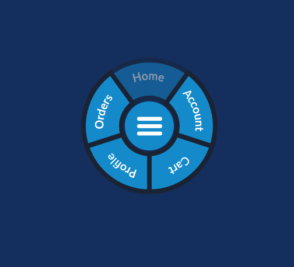
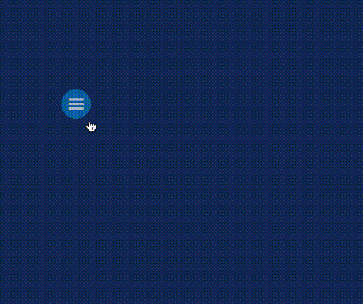

![Built With Stencil](https://img.shields.io/badge/-Built%20With%20Stencil-16161d.svg?logo=data%3Aimage%2Fsvg%2Bxml%3Bbase64%2CPD94bWwgdmVyc2lvbj0iMS4wIiBlbmNvZGluZz0idXRmLTgiPz4KPCEtLSBHZW5lcmF0b3I6IEFkb2JlIElsbHVzdHJhdG9yIDE5LjIuMSwgU1ZHIEV4cG9ydCBQbHVnLUluIC4gU1ZHIFZlcnNpb246IDYuMDAgQnVpbGQgMCkgIC0tPgo8c3ZnIHZlcnNpb249IjEuMSIgaWQ9IkxheWVyXzEiIHhtbG5zPSJodHRwOi8vd3d3LnczLm9yZy8yMDAwL3N2ZyIgeG1sbnM6eGxpbms9Imh0dHA6Ly93d3cudzMub3JnLzE5OTkveGxpbmsiIHg9IjBweCIgeT0iMHB4IgoJIHZpZXdCb3g9IjAgMCA1MTIgNTEyIiBzdHlsZT0iZW5hYmxlLWJhY2tncm91bmQ6bmV3IDAgMCA1MTIgNTEyOyIgeG1sOnNwYWNlPSJwcmVzZXJ2ZSI%2BCjxzdHlsZSB0eXBlPSJ0ZXh0L2NzcyI%2BCgkuc3Qwe2ZpbGw6I0ZGRkZGRjt9Cjwvc3R5bGU%2BCjxwYXRoIGNsYXNzPSJzdDAiIGQ9Ik00MjQuNywzNzMuOWMwLDM3LjYtNTUuMSw2OC42LTkyLjcsNjguNkgxODAuNGMtMzcuOSwwLTkyLjctMzAuNy05Mi43LTY4LjZ2LTMuNmgzMzYuOVYzNzMuOXoiLz4KPHBhdGggY2xhc3M9InN0MCIgZD0iTTQyNC43LDI5Mi4xSDE4MC40Yy0zNy42LDAtOTIuNy0zMS05Mi43LTY4LjZ2LTMuNkgzMzJjMzcuNiwwLDkyLjcsMzEsOTIuNyw2OC42VjI5Mi4xeiIvPgo8cGF0aCBjbGFzcz0ic3QwIiBkPSJNNDI0LjcsMTQxLjdIODcuN3YtMy42YzAtMzcuNiw1NC44LTY4LjYsOTIuNy02OC42SDMzMmMzNy45LDAsOTIuNywzMC43LDkyLjcsNjguNlYxNDEuN3oiLz4KPC9zdmc%2BCg%3D%3D&colorA=16161d&style=flat-square)


# Radial Menu


   
**Note**: Here the component is pictured in its open state.
Clicking its center toggles the visibility of the menu items.

# Preview In Action
 
# Aim

A common strategy for responsive websites is to collapse the menu bar into a 'hamburger menu' which then offers a menu that slides into view. This is often clunky and disorienting. This component offers a solution that is unobtrusive and gives control over its location to the user.

# Web Component

This is a _Web Component_ , which means it is framework agnostic and therefore has no dependencies on any library or framework. It runs entirely on web standards which means it can be used stand-alone in the broswer or integrated into the framework of library of your choice (such as Angular or React).

Because they are closer to the metal, web-components are more performant compared to their runtime-dependent counterparts.

# Features

The radial menu implements the following features:

1. **Dynamic Menu** 
- The radial menu dynamically resizes itself according to the number of objects passed to it.

2. **Colored Sections**
- Each menu item can have its background color set independent of its neighbors.

3. **Center Thumb**
- The center touch target can have its color set.
  
4. **Draggable**
- Position the menu anywhere on the page.
- Its location is saved to local storage so that it will appear in the last used location
  
# Usage
1. Import the module into your index.html
```bash
<script type="module" src="/build/radial-menu.esm.js"></script>
<script nomodule src="/build/radial-menu.js"></script>
```

2. Create the custom tag setting its properties
```bash
 <radial-menu
      menu-items="[]"
      font-color="#fff"
      center-color="#0088cc"
      size="120"
    ></radial-menu>
```
**Note**: If you do not wish to have the hamburger icon within a colored circle, set 'center-color' to 'none'

3. Create a &lt;script&gt; tag alonside your component that describes the event callbacks you would like the component to handle, along with an array of menu items describing their color and label to display.
```bash
 <script>
      const handleAccountClicked = () => {
        console.log('Account Clicked!');
      };
      const handleCartClicked = () => {
        console.log('Cart Clicked!');
      };
      const handleProfileClicked = () => {
        console.log('Profile Clicked!');
      };

      const handleOrdersClicked = () => {
        console.log('Orders Clicked!');
      };

      const handleHomeClicked = () => {
        console.log('Home Clicked!');
      };

      const radialMenuElement = document.querySelector('radial-menu');
      radialMenuElement.menuItems = [
        { color: '#0088cc', label: 'Account', callback: handleAccountClicked },
        { color: '#0088cc', label: 'Cart', callback: handleCartClicked },
        { color: '#0088cc', label: 'Profile', callback: handleProfileClicked },
        { color: '#0088cc', label: 'Orders', callback: handleOrdersClicked },
        { color: '#0088cc', label: 'Home', callback: handleHomeClicked },
      ];
    </script>
```

Or import into your project via NPM
```
npm install @montoyland/radial-menu
```
In this case, when including via an html script tag you'll find the module at:

```
		<script
			type="module"
			src="node_modules/@montoyland/radial-menu/dist/radial-menu/radial-menu.esm.js"
		></script>
		<script
			nomodule
			src="node_modules/@montoyland/radial-menu/dist/radial-menu/build/radial-menu.js"
		></script>
```
That's it!


# How to Use Stencil

Stencil is also great for building entire apps. For that, use the [stencil-app-starter](https://github.com/ionic-team/stencil-app-starter) instead.

# Stencil

Stencil is a compiler for building fast web apps using Web Components.

Stencil combines the best concepts of the most popular frontend frameworks into a compile-time rather than run-time tool.  Stencil takes TypeScript, JSX, a tiny virtual DOM layer, efficient one-way data binding, an asynchronous rendering pipeline (similar to React Fiber), and lazy-loading out of the box, and generates 100% standards-based Web Components that run in any browser supporting the Custom Elements v1 spec.

Stencil components are just Web Components, so they work in any major framework or with no framework at all.

## Getting Started

To start building a new web component using Stencil, clone this repo to a new directory:

```bash
git clone https://github.com/ionic-team/stencil-component-starter.git my-component
cd my-component
git remote rm origin
```

and run:

```bash
npm install
npm start
```

To build the component for production, run:

```bash
npm run build
```

To run the unit tests for the components, run:

```bash
npm test
```

Need help? Check out our docs [here](https://stenciljs.com/docs/my-first-component).


## Naming Components

When creating new component tags, we recommend _not_ using `stencil` in the component name (ex: `<stencil-datepicker>`). This is because the generated component has little to nothing to do with Stencil; it's just a web component!

Instead, use a prefix that fits your company or any name for a group of related components. For example, all of the Ionic generated web components use the prefix `ion`.


## Using this component

There are three strategies we recommend for using web components built with Stencil.

The first step for all three of these strategies is to [publish to NPM](https://docs.npmjs.com/getting-started/publishing-npm-packages).

### Script tag

- Put a script tag similar to this `<script src='https://unpkg.com/my-component@0.0.1/dist/my-component.esm.js'></script>` in the head of your index.html
- Then you can use the element anywhere in your template, JSX, html etc

### Node Modules
- Run `npm install my-component --save`
- Put a script tag similar to this `<script src='node_modules/my-component/dist/my-component.esm.js'></script>` in the head of your index.html
- Then you can use the element anywhere in your template, JSX, html etc

### In a stencil-starter app
- Run `npm install my-component --save`
- Add an import to the npm packages `import my-component;`
- Then you can use the element anywhere in your template, JSX, html etc
