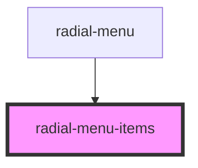

# radial-menu-items

<!-- Auto Generated Below -->

## Properties

| Property     | Attribute     | Description | Type         | Default     |
| ------------ | ------------- | ----------- | ------------ | ----------- |
| `color`      | `color`       |             | `string`     | `undefined` |
| `isDragging` | `is-dragging` |             | `boolean`    | `false`     |
| `menuItems`  | --            |             | `MenuItem[]` | `undefined` |
| `size`       | `size`        |             | `number`     | `undefined` |
| `visible`    | `visible`     |             | `boolean`    | `false`     |

## Dependencies

### Used by

 - [radial-menu](../radial-menu)

### Graph

----------------------------------------------

*Built with [StencilJS](https://stenciljs.com/)*
