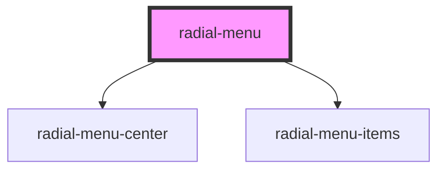

# radial-menu

<!-- Auto Generated Below -->

## Properties

| Property      | Attribute      | Description | Type         | Default     |
| ------------- | -------------- | ----------- | ------------ | ----------- |
| `centerColor` | `center-color` |             | `string`     | `undefined` |
| `fontColor`   | `font-color`   |             | `string`     | `undefined` |
| `menuItems`   | --             |             | `MenuItem[]` | `undefined` |
| `size`        | `size`         |             | `number`     | `undefined` |

## Dependencies

### Depends on

- [radial-menu-center](../radial-menu-center)
- [radial-menu-items](../radial-menu-items)

### Graph

----------------------------------------------

*Built with [StencilJS](https://stenciljs.com/)*
